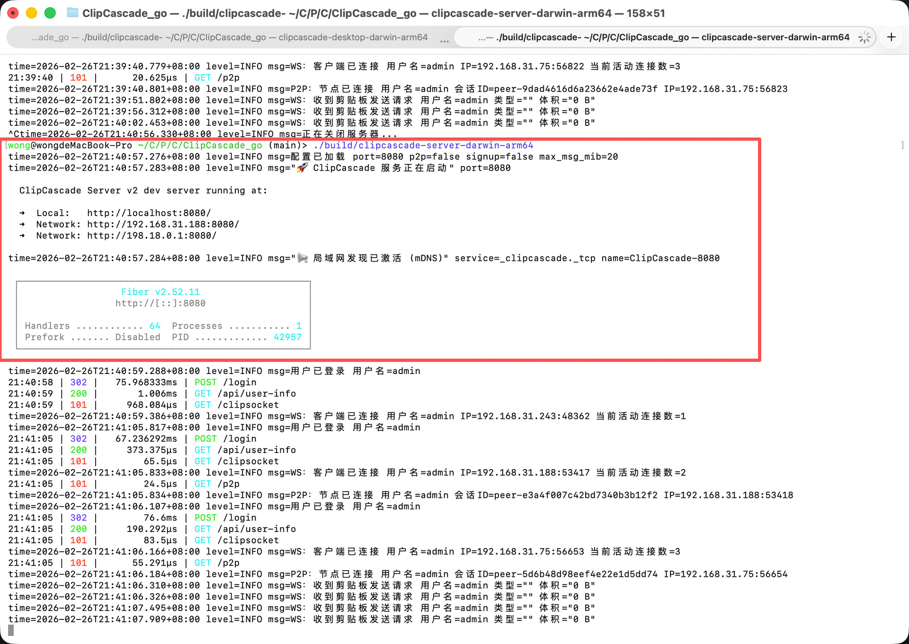
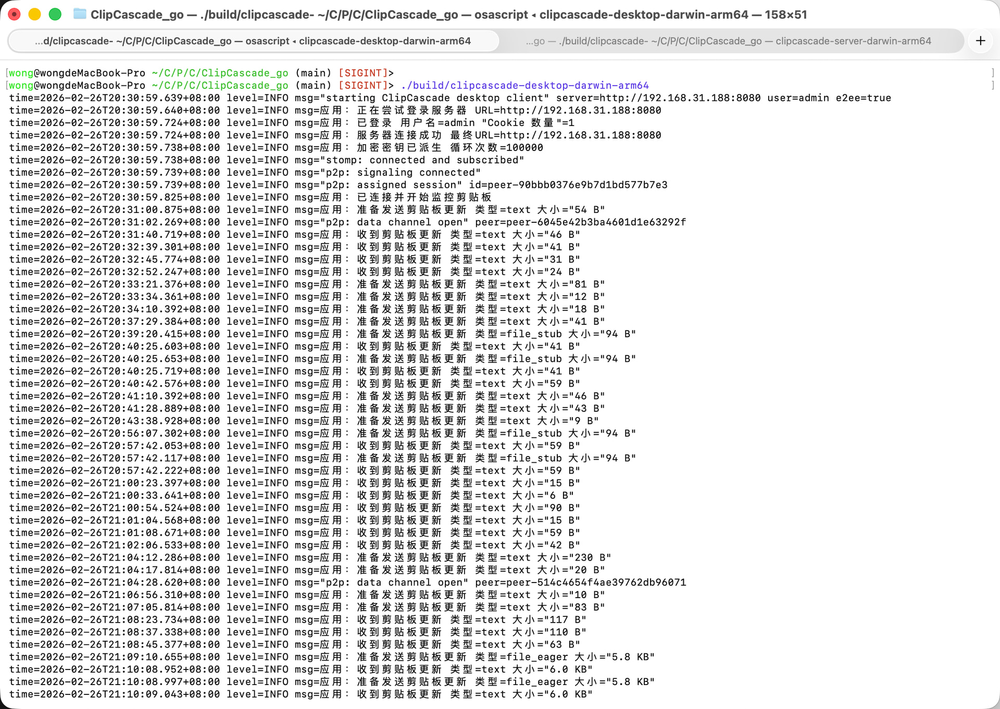
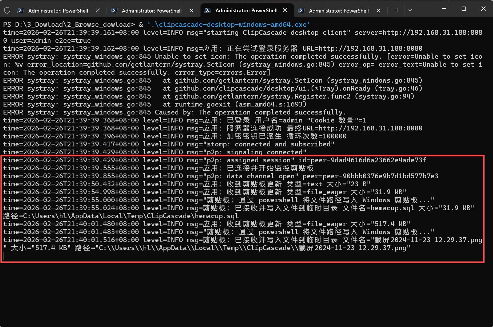
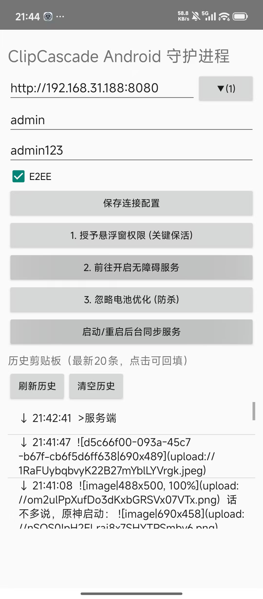
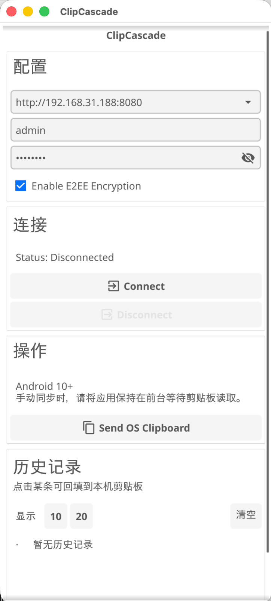

# ClipCascade Go

一个面向多设备协作的跨平台剪贴板同步工具。  
目标不是“再造一个聊天工具”，而是让跨设备复制粘贴尽量接近本机体验。

## 项目介绍

在日常开发和办公场景里，Mac、Windows、Linux、Android 经常混用。  
文本、截图、文件在不同设备之间来回传，会出现这些问题：

- 需要手动打开中转工具，打断工作流。
- 不同平台剪贴板行为差异大，体验不一致。
- 文件传输要么太重，要么太慢，且难统一管理。

ClipCascade 的定位是：以剪贴板为中心，做一个可自部署、可扩展、可跨平台的同步系统。

## 核心能力

- 文本同步：复制后实时同步到在线设备。
- 图片同步：跨平台传输图片剪贴板内容。
- 文件同步：支持小文件直传与大文件占位通知的分层策略。
- 传输通道：支持 STOMP（服务端中转）+ P2P（点对点）双通道。
- 安全能力：支持 E2EE 开关。
- 自动发现：局域网 mDNS 自动发现服务地址。
- 多用户管理：支持管理员在 Web 页面直接新增用户。
- Android 原生保活：前台服务 + 无障碍触发 + 权限引导。
- 剪贴板历史：移动端支持历史记录查看和回填。

## 支持平台

| 模块 | 平台 |
| --- | --- |
| Server | Linux / macOS / Windows |
| Desktop（托盘版） | Linux / macOS / Windows |
| Desktop UI（Fyne） | Linux / macOS / Windows |
| Mobile（Fyne） | Android / iOS（受签名环境影响） |
| Android Native 保活版 | Android |

## 快速开始
> 以 macOS 为例 服务端启动


> 以 macOS 为例 桌面端启动


> win 桌面端


| Android 桌面端启动 | Desktop UI 端 |
| :---: | :---: |
|  |  |

那么这么棒的软件，它有没有带 UI 端的？  
有的兄弟，包有的。PC 端这里也有 UI 的部分，而且都附带网络自动发现。


如果要手动指定账户密码的话，可以这样
```
./build/clipcascade-desktop-ui-darwin-arm64 --server http://127.0.0.1:8080 --username admin --password admin123 --save
```

## 解决什么问题


### 1)网络问题
不需要切换软件就能直接同步到另一台电脑
不同平台的剪切板不够不互通
不需要安装什么奇怪的输入法登录同步
不需要联网敏感
数据也能发


### 2)Android
很多软件在安卓10以上之后，它就不能在后台了。常驻后台。需要开启一串的东西，因为手机端主要是保证续航。
很多的常规打包软件都是不具备这样的能力的，需要编写特定化的代码。(当然这里我已经做了)

## 执行构建
### 1) 一键构建

```bash
./scripts/build.sh all
```

`all` 会尝试构建：
- server 全平台
- desktop 全平台
- desktop-ui（当前平台）
- mobile-android
- mobile-ios
- desktop-ui-cross（依赖 Docker）

说明：
- Linux desktop 交叉编译依赖 Docker daemon（未启动会被跳过并告警）。
- iOS 打包需要 Apple 开发者证书（无证书会告警）。

### 2) 启动服务端

```bash
./build/clipcascade-server-darwin-arm64
```

默认账号：`admin / admin123`

### 3) 启动桌面端

首次保存配置：

```bash
./build/clipcascade-desktop-darwin-arm64 --server http://127.0.0.1:8080 --username admin --password admin123 --save
```

调试日志：

```bash
./build/clipcascade-desktop-darwin-arm64 --debug
```

## 用户管理

- 默认 `signup` 关闭。
- `/signup` 在关闭时会返回 `Signup is disabled`。
- 登录页在 `signup` 关闭时不再显示“Create an account”。

新增用户（无需手调接口）：

1. 管理员登录后打开 `/advance`。
2. 点击 `+ Add User`。
3. 输入用户名和密码即可创建。

## 同步策略（当前设计）

### 文本/图片

- 复制后实时同步。

### 文件

- 单文件且大小 `<= 20 MiB`：`file_eager` 直传。
- 多文件或超大文件：`file_stub` 占位（元信息通知）。

接收端 `file_eager` 行为：

- 落盘到临时目录：
  - macOS/Linux: `${TMPDIR}/ClipCascade` 或 `/tmp/ClipCascade`
  - Windows: `%LOCALAPPDATA%\\Temp\\ClipCascade`
- 同时写入系统剪贴板文件路径，用户可直接粘贴。

临时文件清理：

- 接收文件时会自动清理 `24 小时`前的旧临时文件。

## 构建与环境

### 环境准备（必看）

基础环境：

- Go `1.22+`（建议与 CI 一致，当前 CI 使用 `1.25`）
- Git
- `PATH` 包含 `$(go env GOPATH)/bin`

按构建目标补充：

- Desktop/Linux 交叉编译：需要 Docker，并确保 Docker daemon 已启动。
- macOS Desktop 构建：需要 Xcode Command Line Tools（`xcode-select --install`）。
- Android（Fyne）构建：需要 Android SDK / NDK。
- Android 原生保活版（`mobile-android-native`）：
  - JDK `17`
  - Android SDK（`platform-tools`、`platforms;android-34`、`build-tools;34.0.0`）
  - Android NDK（建议 `26.1.10909125`）
  - `gomobile`（`go install golang.org/x/mobile/cmd/gomobile@latest && gomobile init`）

建议设置的环境变量（Android 原生保活版）：

```bash
export ANDROID_HOME="$ANDROID_SDK_ROOT"
export ANDROID_NDK_HOME="$ANDROID_SDK_ROOT/ndk/26.1.10909125"
export CC_ANDROID_API=26
```

说明：

- 项目已内置 `mobile/android/gradlew`，不要求全局安装 Gradle。
- 若遇到 Gradle 缓存污染，可删除根目录 `.gradle-user-home/` 后重试。

### 常用构建命令

```bash
./scripts/build.sh server
./scripts/build.sh server-cross
./scripts/build.sh desktop
./scripts/build.sh cross
./scripts/build.sh desktop-ui
./scripts/build.sh mobile-android
./scripts/build.sh mobile-android-native
```

`mobile-android-native` 产物说明：

- 可直接安装（推荐）：`build/ClipCascade-Android-Debug.apk`
- 便捷别名：`build/ClipCascade-Android-Installable.apk`
- 发布包（未签名）：`build/ClipCascade-Android-Release-Unsigned.apk`

### Windows 黑框模式

- 默认：Windows 桌面端保留控制台黑框（便于看日志）。
- 无黑框托盘模式：

```bash
CLIPCASCADE_WINDOWS_GUI=1 ./scripts/build.sh cross
```

## 关键环境变量（Server）

```bash
CC_PORT=8080
CC_SIGNUP_ENABLED=false
CC_P2P_ENABLED=false
CC_P2P_STUN_URL=stun:stun.l.google.com:19302
CC_MAX_MESSAGE_SIZE_IN_MiB=20
CC_ALLOWED_ORIGINS=*
CC_DATABASE_PATH=./database/clipcascade.db
```

## 常见问题

### 1) Docker 相关构建失败

报错：`Cannot connect to the Docker daemon ...`

处理：

```bash
open -a Docker
# 或
open -a OrbStack
```

确认 `docker info` 正常后重试。

### 2) 登录页点 Create 显示 Signup is disabled

这是配置行为（默认关闭注册）。

- 开启公开注册：`CC_SIGNUP_ENABLED=true`
- 推荐方式：保持关闭，由管理员在 `/advance` 新增用户。

### 3) 文件能收到提示但粘贴不可用

请确认两端都使用最新 desktop 二进制，并检查日志是否出现：

- `应用：准备发送剪贴板更新 类型=file_eager`
- `剪贴板：已接收并写入文件到临时目录`

### 4) Android 安装时报“解析软件包出现问题 / packageInfo is null”

通常是安装了 `Release-Unsigned` 包。该包未签名，系统会拒绝安装。

请改为安装：

- `build/ClipCascade-Android-Debug.apk`
- 或 `build/ClipCascade-Android-Installable.apk`
